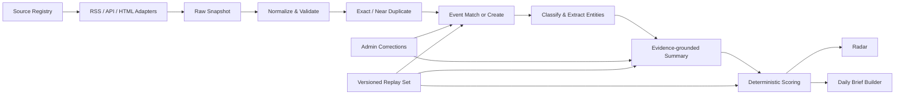

# ScoutNews V0 产品与技术规格

> **历史规划提示（2026-09-17 补充）：** 本文保留 2026-07-27 的 Draft v0.4，描述当时目标，不是当前发布说明。以下原始正文继续保留，已实现范围以 [项目状态](PROJECT-STATUS.md)、[当前架构](ARCHITECTURE.md) 和 [公开阅读契约](PUBLIC-READER.md) 为准。

> 原始状态：Draft v0.4  
> 日期：2026-07-27  
> 阶段：需求与方案定义，不包含实现代码  
> 默认时区：Asia/Shanghai  
> 目标技术栈：TypeScript Web 前端、Rust 核心后端；GitHub Copilot SDK 如无 Rust SDK，则使用隔离的 TypeScript Provider Gateway

## 当前实现对照（不改写七月规划）

| 七月规划中的描述 | 2026-09-17 当前实现 / 边界 |
| --- | --- |
| 仅本地、后期才公开 | 私有核心仍为本地单用户；另有 5190 只读试用门户，不是多用户 SaaS |
| Next.js、独立 Worker | React/Vite；Worker 在同一个 Rust API 进程；Gateway 是独立 TypeScript 进程 |
| 先做 GitHub App/OAuth | 默认复用本机 GitHub/Copilot 登录，OAuth App 为可选替代通道 |
| Azure OpenAI 备用调用 | 仅有配置位置，未实现调用，不是可用 fallback |
| 08:00、每日 5–10 条 | 默认 06:00 Asia/Shanghai；简报上限默认 20，可设 5–30，材料不足如实减少 |
| 第 11 节的 H 公式与逐项计分说明 | 当前个人推荐采用价值 30%、来源/证据 25%、兴趣 20%、时效 15%、主动反馈 5%、独立覆盖 5%；阅读价值不展示内部日志 |
| 固定 40–100 字摘要 | 当前自适应要点；列表紧凑预览，详情展示完整要点及已收录来源内容 |
| 语义聚类、管理员合并/拆分、事实关系图 | 当前是精确事件/发布家族分组和关键词共现主题图，不是完整语义或因果图 |
| Podcast transcript/转写队列 | 当前取得节目说明、真实章节/时长和可用链接；自动音频转写未实现 |
| 第 13 节拟议 API / 稳定游标 | 以路由源码为准；公开端使用 `/beta/api`、有界 offset 与 `asOf`，不是本节整套 API |
| Phase 4 / 连续 14 天验收 | 尚无完整完成证据，不因 0.2 可用或一次 UI 交付而视为通过 |

当前启动、测试与文档维护入口见 [文档索引](README.md)。以下编号继续沿用原始规划，便于追溯。

## 1. 文档目的

本文将三篇参考材料中的方法论，与 AIHOT、Agent Pulse、InfoPie 三个产品的公开体验结合，定义 ScoutNews 的 V0 基线。V0 的职责不是替用户阅读整个互联网，而是把有限的高质量信源加工成可追溯、可解释、低负担的跨领域事件流与每日简报。

V0 经验证后，再将使用者的个人关注、判断标准和工作流加入 V1。

## 2. 背景与核心问题

目标领域包括但不限于：

- AI：研究、模型、产品、工程实践、产业动态；
- 心理学：研究发现、方法、复现、应用与伦理；
- HCI：学术研究、交互范式、工具、可用性与无障碍；
- Design：产品设计、视觉与工业设计、设计系统、工具与案例。

内容形态不仅包括文章、论文和产品发布，也要能够容纳 Podcast feed、episode、show notes 和带时间戳的 transcript。V0 应预留统一内容模型；Podcast 的完整音频转写与语义切片按阶段启用。

现有聚合产品通常只解决“把链接放在一起”，仍留下五个问题：

1. 信源质量不透明，二次转述与一手发布混在一起；
2. 同一事件被多篇文章重复呈现；
3. 热度常等同于点击量，重要但小众的信号被淹没；
4. 摘要与排序缺乏证据和解释；
5. 实时流适合探索，却不适合每天快速获取重点。

因此，V0 的核心对象应是“事件”，文章、论文和 Podcast episode 都只是事件的证据；核心资产应是经过治理的信源目录，而不是无边界爬取的内容数量。

## 3. 参考材料洞察

### 3.1 《一款 AI 信息聚合产品》

- 用户需要简洁、流畅、真实有用且对专业人士友好的信息入口。
- 聚合可以跨领域，但每个领域都要有明确的信息质量标准。
- 一手信号优先，主动降低二创、情绪稿和推广内容的权重。
- 产品发现应保持克制，商业推广不能伪装为自然热点。

### 3.2 《全盘托出我的一手信源……重启 RSS》

- AI 时代稀缺的不是内容，而是一份长期可信的一手信源清单。
- RSS、官方博客、研究报告、播客、视频等应被统一组织。
- 聚合的长期价值是形成可检索、可收藏、可回看的知识库。
- 不同信源接入方式不同，应把桥接与正文产品解耦。

### 3.3 《这个封装了我 3 年自媒体经验的 AI 热点网站……》

- 工作流可拆为获取信息、分析信息、基于信息决策；V0 先把获取与筛选做好。
- 信源应分级，一手源、官方社交源、个人与媒体源承担不同角色。
- 处理应采用“程序预筛 → 模型执行语义任务 → 确定性规则重排 → 精选”，不能让模型独自承担全部决策。
- “能用脚本就不用 Agent”：抓取、去重、定时分发等确定性工作不需要自主 Agent。
- 日报应从已处理事件中稳定生成，而不是在发送时临时让模型重新判断。
- 复杂实体热度预测在数据不足时不可校准，V0 应使用简单、可解释、可回放的规则。

### 3.4 综合结论

ScoutNews 应同时具备三层能力：

1. 信源层：精选、分级、持续健康检查；
2. 事件层：跨来源去重、聚类、证据化摘要与演化记录；
3. 阅读层：实时 Radar 用于探索，Daily Brief 用于注意力压缩。

## 4. 竞品分析

| 产品 | 可吸收的优点 | 应避免或补足的问题 | ScoutNews 的取舍 |
|---|---|---|---|
| AIHOT | 精选与全量分离；日报/周报/月报层次清楚；阅读时长、看点目录和来源展示有效降低负担 | 聚焦单一 AI 领域；事件关系和入选原因不够突出；公开侧策略较难审计 | 保留 Daily Brief 和全量 Radar 双入口；增加领域、证据等级、事件演化与入选理由 |
| Agent Pulse | 以事件而非文章为中心；支持多次进展；官方来源、多源核验和领域筛选明确 | 信息密度较高；更像研究档案，日常快速消费成本偏高；筛选项对新用户较重 | 使用事件聚类和证据标识，但默认页面保持轻量，高级筛选渐进展开 |
| InfoPie | 极简、阅读顺滑；多领域 Tab 易理解；摘要可以帮助快速初筛 | 更新状态不透明；列表页来源和证据不够醒目；长摘要增加滚动成本；事件去重不突出 | 保留低干扰多领域信息流；摘要分层展示；显式呈现来源、时间、证据与更新状态 |

产品组合原则：InfoPie 的低负担信息流 + Agent Pulse 的事件与证据模型 + AIHOT 的信源治理和日报机制。

## 5. 产品定义

### 5.1 一句话定位

ScoutNews 是面向跨领域探索者的可追溯热点雷达：将高质量信源转化为可解释、可核验、低阅读负担的事件流和每日简报。

### 5.2 目标用户

- 同时关注技术、心理、人机交互和设计的产品从业者；
- 需要跟踪研究与产业变化的研究者、设计师和工程师；
- 需要高质量选题，但不愿在二手资讯中消耗时间的创作者；
- 首阶段为本地运行的单个个人用户，不部署、不建设公共注册入口；后期才扩展为 Azure 上的小规模多用户产品。

### 5.3 Jobs to Be Done

- 当一天开始时，希望在 3–5 分钟内知道过去 24 小时真正值得关注的变化。
- 当探索某个领域时，希望浏览最新事件，并按领域、类型、来源和证据筛选。
- 当看到一条摘要时，希望知道它为什么入选、基于哪些原文、是否被独立来源核验。
- 当之后研究一个主题时，希望能找到过去收藏的事件和原始材料。

### 5.4 产品原则

1. 信源比数量重要，一手来源优先。
2. 事件优先于文章，证据优先于结论。
3. 摘要不替代原文，所有事实可追溯。
4. 热点代表“新近且值得注意的变化”，不等同于流量。
5. 模型负责语义理解，规则负责约束、计分和最终选择。
6. 默认简单，高级能力逐步显露。
7. 跨领域不是混成一个大池，而是允许独立浏览和交叉连接。
8. 任何自动处理都要可回放、可版本化、可人工纠正。
9. 用户明确输入的兴趣与工作背景优先于隐式画像，并允许随时查看、修改和关闭。
10. 模型提供方必须可替换；身份、额度归属和模型能力不能混为一谈。

## 6. V0 范围

> 历史范围：本节是目标集合。已交付、部分实现和访问受限项请对照 `PROJECT-STATUS.md`，尤其不要把 5–10 条、全部平台接入或完整关系图当作当前保证。

### 6.1 必须交付

- 可配置的宽领域、Topic 与用户 Watchlist；默认含 AI、心理学、HCI、Design，并加入 Developer/Rust 等个人主题；
- 信源注册、分级、启停、抓取策略和健康状态；
- RSS/Atom 优先，公开 API 次之，必要时使用站点 HTML 适配器；
- Podcast RSS、episode 元数据和 show notes 采集；若来源合法提供 transcript，则一并索引；
- 文章规范化、URL 去重、近似内容去重和事件聚类；
- 中文短摘要、原始标题、原文语言和原文链接；
- 事件证据标识：官方来源、独立来源数、最高信源等级；
- 可解释热点评分和“为何入选”；
- Radar 实时事件流及基本筛选、搜索；
- 每日 5–10 条 Daily Brief，支持历史日期浏览；
- 收藏、已读、稍后读；
- 最小管理面：信源、事件合并/拆分、摘要修正、置顶/排除；
- 处理日志、失败重试、规则版本和历史回放评估集。
- 事件关系的持久化基础：事件、实体、主题之间的显式关系及其证据、置信度和生成方式；V0 先以“关联事件”列表呈现。

### 6.2 明确不做

- 无边界全网抓取或绕过登录、付费墙、验证码；
- 复杂的协同过滤或个性化推荐系统；
- 由全自动 Agent 自主决定抓取、判断和发布；
- 评论、关注关系、社交分享网络；
- 原生移动 App；
- 自动生成脱离来源的长篇观点文章；
- 不可解释的实体热度预测和舆情预测；
- 完整知识图谱数据库、无限画布式全局关系图、向量知识问答、自动生成播客；
- 对没有合法 transcript 的任意 Podcast 音频做默认全量转写；
- 周报/月报、多用户团队协作和外部推送渠道，除非 V0 核心提前稳定。

### 6.3 已确定的运行阶段

| 阶段 | 用户与部署 | 模型来源 | 说明 |
|---|---|---|---|
| V0 本地个人版 | 单用户、本机运行、不部署；仍需完成 GitHub 授权 | 默认使用本人的 GitHub Copilot subscription；Azure OpenAI 仅作为显式选择的备用/对照 Provider | V0 即完成 Copilot SDK、GitHub OAuth、模型能力探测、token 本地安全存储和用户级限额验证 |
| V1 Azure 私测版 | Azure 部署、GitHub 身份登录、少量用户 | 优先使用每位用户自己的 GitHub Copilot subscription；不具备资格时明确提示 | 将 V0 已验证的单用户 Provider 扩展为按用户隔离；不静默消耗平台额度 |
| 后期普通用户版 | Azure 部署、普通用户账号 | 平台方 Azure OpenAI deployment | 优先级较低；需要预算、配额、滥用防护和计费政策后再开放 |

## 7. 信息架构与页面

### 7.1 主导航

1. **今日简报**：过去 24 小时精选事件；
2. **Radar**：按时间和分数浏览全部合格事件；
3. **主题**：宽领域、个人 Topic、当前项目与交叉主题；
4. **收藏**：收藏、稍后读和已读历史；
5. **来源**：查看信源说明、等级与健康状态；
6. **管理**：仅管理员可见。
7. **兴趣画像**：用户主动维护关注领域、工作领域、主题、实体、排除项和权重；V0 本地版可用简单设置页实现。

### 7.2 事件卡片

默认层只显示：

- 中文事件标题；
- 1–2 句事实摘要；
- 领域与事件类型；
- 首次/最近发现时间；
- 最高信源等级、来源数、官方/多源核验标记；
- 一句入选原因；
- 收藏、已读、打开详情。

展开后显示：为何重要、事件进展、全部证据文章、原始标题、来源与原文链接。摘要不应让用户误以为模型文本是原文。

Podcast 证据额外显示节目名、episode、发布时间、时长、show notes、可用 transcript 的时间戳，以及“从此处播放”。事件摘要引用 Podcast 时必须能定位到 show notes 或 transcript 片段；只有音频而没有可引用文本时，需明确标记证据来源和转写方式。

### 7.3 关键流程

**每日获取重点**：打开今日简报 → 扫描看点 → 展开事件 → 检查证据/原文 → 收藏或标为已读。

**主题探索**：进入 Radar → 选择领域/类型/证据级别/时间 → 搜索或浏览 → 进入事件详情 → 查看演化与多来源。

**管理员校正**：查看处理异常 → 合并或拆分事件 → 修正摘要/分类 → 记录操作者、原因和前后版本。

**维护兴趣画像**：输入工作领域与关注主题 → 选择权重/排除项 → 预览受影响事件 → 保存 → 在 Radar、Brief 和关系视图中查看“与我相关”的解释。

## 8. 可扩展的关注与信源模型

固定的“微信公众号、Builders、新闻媒体、Podcast”五分类把主题、主体、内容类型和传输渠道混在了一起，无法支持后续持续加源。ScoutNews 改为四个相互独立的维度：

| 维度 | 回答的问题 | 示例 |
|---|---|---|
| 关注主题 Topic | 用户为什么关心 | AGI、Agent、Memory、开源模型、编程语言、Rust、Microsoft Agent Framework、心理学、HCI、Design |
| 来源主体 Publisher/Entity | 谁发布或被关注 | Anthropic、OpenAI、Google DeepMind、Microsoft、Hugging Face、研究者、Builder、Podcast 节目 |
| 内容类型 Content Type | 发布了什么 | Blog、Paper、Model、Repository、Release、Social Post、WeChat Article、Podcast Episode、Transcript |
| 采集适配器 Adapter | 如何稳定获取 | RSS/Atom、arXiv API、Hugging Face API、GitHub API/Release Atom、X API、Podcast RSS、HTML Adapter、Manual URL |

每条 Source 可以关联多个主题，但只使用一个明确的采集适配器；同一主体可以有多个 Source。例如 Microsoft Agent Framework 同时拥有 GitHub Release、repository activity、官方文档和 Microsoft Blog，它们各自运行、各自健康检查，但最终可聚合为同一实体的事件。

### 8.1 初始主题与个人兴趣配置

产品仍保留 AI、心理学、HCI、Design 等宽领域用于浏览，但个人关注不被限制在固定频道。V0 默认兴趣种子为：

| 主题组 | 初始主题 |
|---|---|
| AI 前沿 | AGI、基础模型、推理、对齐、安全与治理 |
| Agent 工程 | Agent、Memory、Context、工具调用、MCP、A2A、规划、评测、长期运行 |
| 开源模型 | 模型发布、权重、量化、推理框架、训练/后训练、模型许可 |
| Developer | AI Coding、开发者工具、SDK、编程语言、编译器、数据库与基础设施 |
| Rust | Rust language、compiler、edition、Cargo、生态 crate、异步与性能工程 |
| 正在使用的框架 | Microsoft Agent Framework，以及后续由用户加入的框架、SDK 和协议 |
| 邻接领域 | 心理学、HCI、Design，以及它们与 AI/Agent 的交叉主题 |

“工作领域”“长期兴趣”“当前项目”分开保存：工作领域变化慢；长期兴趣决定默认 Radar；当前项目（如 Microsoft Agent Framework）给予较高但可过期的相关度。所有主题、实体和查询都可增删、设置权重和有效期，不写死在代码里。

### 8.2 两类采集任务

1. **Monitor（监听）**：对已确认的公司、人物、仓库、节目和查询增量获取；强调不漏、低延迟和幂等。
2. **Discover（发现）**：定期寻找新项目、新模型、新论文、新人物或新来源；强调候选召回，结果先进入观察区，不能直接成为可信事件。

GitHub Release、公司 RSS、Podcast RSS 属于 Monitor；GitHub 活跃项目、Hugging Face trending、arXiv 主题查询同时可承担 Discover。两者必须分别记录游标、运行频率、质量指标和错误，不允许发现榜单直接影响热点分。

### 8.3 来源获取 Playbook

以下频率是本地 V0 的起点，实际运行应遵守响应中的缓存、限额和退避信号，并可按来源活跃度自适应调整。

| 来源形态 | Monitor 最佳实践 | Discover 最佳实践 | 初始频率 | 增量键与去重 |
|---|---|---|---|---|
| 公司/实验室 Blog | 优先官方 RSS/Atom；使用 ETag、Last-Modified 和 conditional GET。没有 Feed（如当前 Anthropic）时才使用站点级 HTML/sitemap adapter，并做结构契约测试 | 每月检查 sitemap、导航和官方账号，发现新栏目、工程博客或 changelog | Feed 15–30 分钟；HTML 1–3 小时 | canonical URL + published/updated + content hash |
| Paper | arXiv API/RSS 按分类、关键词、作者和机构查询；使用 submitted/updated 时间与 arXiv ID/version；Crossref/OpenAlex 可补 DOI、引用和作者实体 | 每日扩展关键词、引用链和会议/期刊候选；发现结果需语义筛选 | arXiv 每日 1–2 次；引用元数据每日/每周 | arXiv ID + version；DOI；标题/作者近似匹配 |
| Hugging Face Model | 对关注组织/作者/模型轮询 Hub API，比较 model ID、lastModified、revision SHA、tags、license、downloads/likes 快照；重大更新读取 model card/repo revision | 每 6–24 小时保存 trendingScore、近期更新和主题筛选快照；不能把一次榜单名次当作事实热度 | Watchlist 30–60 分钟；Discover 6 小时 | model ID + revision SHA；指标使用时间序列快照 |
| GitHub 已知项目 | 优先 Releases API 或 `releases.atom`；必要时补 tags、default branch、issues/discussions。认证请求，缓存 ETag，遵守 rate-limit headers | GitHub 没有稳定官方 Trending API；使用 Search API 的 stars、created、pushed、topic/language 查询做每日候选快照，结合新增 star、独立讨论和来源质量复核 | Release 15–30 分钟；项目状态 2–6 小时；Discover 每日 | repo ID、release ID/tag、commit SHA；star/fork 只保存快照增量 |
| X Builder | 仅使用 X 官方 API 的 user timeline，保存 since_id，按用户批次轮询；同时优先登记该人物可自动更新的 Blog/GitHub/Podcast | Builder 候选来自现有网络、Podcast 嘉宾、论文作者和人工推荐，审核后才加入 Watchlist | 取决于 API plan，目标 5–30 分钟；受限时 1–6 小时 | post ID；引用/转帖关系；删除状态 |
| 微信公众号 | 优先公众号作者提供的官网同步页、公开 RSS、newsletter 或手动提交公开文章 URL；逐源 adapter，不绕过登录/访问控制 | 从已读文章作者、引用链和人工推荐发现，先人工确认 | 手动即时；获授权 Feed 30–60 分钟；HTML 2–6 小时 | 公开 URL、文章 ID、标题+发布时间+作者 |
| Podcast | Listen Notes 仅用于按节目名发现并取得 RSS；人工核验节目作者、官网和 Feed 后，直接 conditional GET canonical Podcast RSS | 按嘉宾、公司创始人、主题和相关节目发现新节目/episode；候选 Feed 人工确认 | RSS 30–120 分钟；低频节目 6 小时 | feed URL + GUID；缺 GUID 时 enclosure URL + 发布时间 + 音频 hash |
| 框架/语言生态 | 将官方 Blog、GitHub Release、changelog、RFC/提案和文档更新组合成 Source Bundle。Microsoft Agent Framework、Rust 均采用此方式 | 从依赖、RFC 引用、生态项目和使用中的工具发现新 Source Bundle | Release 15–30 分钟；Blog 30–60 分钟；RFC/文档 2–6 小时 | 每种子源自己的稳定 ID，事件层按实体+版本+时间聚类 |

已验证的示例入口包括 OpenAI News RSS、Google/DeepMind RSS、Rust Blog RSS、GitHub repository Release Atom、arXiv API、Hugging Face Hub API、GitHub API、X API 和 Podcast RSS。具体 URL 不固化在业务代码中，而作为可更新的 Source Registry 数据与 adapter 配置。

### 8.4 参考工具的可复用经验

- **Agent Pulse**：公开来源页将领域覆盖、地域、采集通道和运行状态分开，并使用 GitHub Release、RSS/Atom、公开网页、官方 API、受限平台和 arXiv 等通道；ScoutNews 采用这种正交建模和成熟度状态，而不复制其来源数据。
- **AIHOT**：吸收 T1/T1.5/T2 分级、程序/模型分工和精选机制；其公开站点没有给出足够细的逐源接入清单，因此不据此推断具体抓取方案。
- **InfoPie**：吸收官方工程 Blog、arXiv、Hugging Face、HN/Lobsters 等一手或专业信号的组合，以及多主题阅读入口。
- **follow-builders**：吸收精选 Builder、确定性采集、原始链接保留、摘要 prompt 可定制，以及采集与模型 remix 分离。ScoutNews 不默认依赖或复制其中心化 feed；X API、Podcast transcript 服务和下游内容权利分别评估。

Listen Notes（<https://www.listennotes.com/api/docs/>）只作为 Podcast discovery provider。以“张小珺Jùn｜商业访谈录”等节目名搜索，核对作者、官网、封面和节目描述后取得结果中的 RSS 字段；确认后保存 canonical RSS、Listen Notes ID、发现时间和人工确认记录。日常 episode 监听不依赖 Listen Notes API。

### 8.5 信源持续更新机制

- Source Registry 是数据而不是代码枚举；支持 UI/配置导入新增、暂停、替换和合并来源。
- 每个主题维护 Coverage Policy：至少包含官方动态、研究、版本发布、社区实践等所需证据类型，并显示缺口。
- 新 Source 状态依次为 Candidate → Reachable → Observing → Stable → Paused/Retired；观察期内容可浏览但默认不进 Daily Brief。
- Adapter 使用版本化接口和 fixture 契约测试；页面结构变化只隔离该 Source，不阻塞整个管线。
- 每周生成来源健康与覆盖报告；每月审阅 Builder/公司/框架清单；用户可随时把当前工作中出现的新框架加入高优先级 Watchlist。
- Source 替换时保留 lineage，例如旧 Feed → 新 Feed，避免重复入库和历史断链。

## 9. 信源治理

### 9.1 分级

| 等级 | 定义 | 示例类型 | 基准质量分 | 使用方式 |
|---|---|---|---:|---|
| T1 | 原始发布者或正式研究来源 | 官方博客、论文/会议页、研究机构、标准组织、项目仓库 release | 100 | 可构成事件主证据 |
| T1.5 | 官方但更短、更快、更杂的渠道 | 官方社交账号、官方 newsletter、发布直播 | 75 | 用于及时发现，尽量回链正式来源 |
| T2 | 有稳定专业判断的独立来源 | 专业作者、垂直媒体、研究解读 | 55 | 用于发现、补充语境和独立核验 |

分级不是永久信誉背书。每个信源还要有 `reliability_modifier`（-20 至 +10），依据历史准确率、原创比例、纠错表现和商业披露进行调整。

进入 Builder Watchlist 不会自动提升信源等级：本人正式发布、项目 release 或官方博客可按 T1 评估；本人社交动态通常按 T1.5；采访、媒体转述和他人评论仍按实际发布渠道定级。人物策展影响“是否监测”，不替代证据质量判断。

### 9.2 来源登记字段

- 名称、主页、Feed/API/抓取地址；
- 可选的 `person_id`/Builder 身份、discovery provider、外部目录 ID、人工确认时间；
- 主领域、语言、地区、来源类型、所属实体；
- 等级与调整分、是否官方；
- 接入方式、抓取频率、限速与合规备注；
- 任务模式（Monitor/Discover）、增量 cursor、ETag/Last-Modified、最近完整回扫时间；
- 媒体类型（text/podcast/video）、Podcast feed 与 transcript 可用性；
- 启用状态、最后成功时间、连续失败次数；
- 内容许可/robots/服务条款检查日期；
- 所有者、加入原因、人工复核记录。

### 9.3 治理规则

- 新来源先进入观察期，不直接影响 Daily Brief；
- Discover 结果只能创建 Candidate；经过身份、端点、许可和样本质量核验后才可晋级为 Monitor Source；
- Builder Watchlist 记录“为何关注”、角色、所属组织、领域和审核日期；人物只是发现入口，其不同渠道仍分别作为 Source 评估；
- 连续失败、内容漂移或低原创率触发降权/停用告警；
- 转载媒体不能因为报道数量多而制造虚假“多源核验”；独立性按所属实体和引用链判断；
- 赞助、联盟链接和推广内容必须标注，默认不进入热点评分；
- 每月至少一次健康与质量复核。

## 10. 内容处理流水线

> 历史流程：图中的语义匹配、管理员纠正与完整回放目标并非全部已交付。当前材料、摘要队列、规则分组和快照链路见 `ARCHITECTURE.md`；现行自适应摘要也不再局限于本节拟议的 40–100 字格式。

### 10.1 采集

1. 调度器读取启用信源；
2. 通过适配器抓取，遵守限速、缓存头和退避策略；
3. 保存响应元数据、内容哈希与必要的原始快照；
4. 解析失败进入隔离队列，不阻塞其他来源。

接入优先级：RSS/Atom（包括 Podcast RSS）→ 官方 API/开放元数据 API → 明确允许的 HTML 页面。社交平台桥接只在合规、稳定且可追溯时采用。

Podcast 采集先处理 feed 和 episode 元数据，再处理 show notes。Transcript 优先级为：创作者官方 transcript → feed/平台合法提供的 transcript → 经明确授权或合理许可后自行转写。不得绕过平台访问控制下载音频；自动转写的文本必须记录模型、语言、时间轴、许可状态和保留期限。

### 10.2 规范化与去重

- 解析 canonical URL，移除已知追踪参数，保留原 URL；
- 统一时间、语言、作者、来源和内容类型；
- URL/内容哈希做精确去重；
- 标题指纹 + 正文相似度做近似转载识别；
- 转载仍可作为证据记录，但不被计作独立来源。

Podcast episode 使用 feed GUID、enclosure URL、节目名、标题、发布日期和音频指纹的组合去重；同一 episode 的多平台镜像不计为多个独立来源。

### 10.3 事件聚类

候选事件由时间窗口、实体、标题关键词和语义相似度召回，再使用版本化阈值匹配。规则：

- 同一发布、论文、产品版本或政策变化聚为一个事件；
- 后续重要更新作为 event update，而非覆盖历史；
- 不确定时宁可暂时分开，避免错误合并；
- 管理员可合并/拆分，修正结果进入回放样本。

### 10.4 模型任务与边界

允许模型完成：领域/类型候选、实体提取、跨语言归一化、基于证据的标题与摘要、相似性辅助判断。

模型不得独自完成：来源等级、最终热点分、最终发布、独立来源判断、事实补全。所有模型输出必须带模型、提示词版本、输入证据 ID 和时间。低置信度输出进入人工复核或降级为仅展示原始元数据。

### 10.5 摘要格式

- **发生了什么**：仅陈述证据支持的事实，40–100 个中文字符；
- **为何重要**：说明对相关领域可能产生的具体影响，允许标注“不确定”；
- **证据**：列出主来源及独立补充来源；
- **禁止**：虚构数字、补全未给出的因果、把媒体推测写成已确认事实。

## 11. 可解释热点评分

> 历史评分方案：下方 H 公式、阈值及“为何入选”文案保留用于追溯，不是当前个人推荐实现。当前权重及“来源与热点分”的不同口径见 `ARCHITECTURE.md`；面向读者使用“阅读价值”，不直接展示规则版本与加分日志。

所有分量归一化到 $[0,100]$。V0 默认：

$$
H = 0.28S + 0.20C + 0.18F + 0.15R + 0.12N + 0.05E + 0.02B
$$

| 分量 | 权重 | 含义 | 计算要点 |
|---|---:|---|---|
| $S$ Source Quality | 0.28 | 主证据质量 | 信源等级基准分 + 历史可靠性调整 |
| $C$ Corroboration | 0.20 | 证据强度 | 是否官方、独立实体数量、是否有正式原文；转载不重复计数 |
| $F$ Freshness | 0.18 | 时效性 | 按事件类型使用可配置半衰期；研究论文可慢于产品发布 |
| $R$ Relevance | 0.15 | 领域相关性 | 与所选领域/主题的匹配度；V0 为全局配置，不是隐式用户画像 |
| $N$ Novelty | 0.12 | 新信息量 | 相对已有事件是否包含新发布、新数据或实质进展 |
| $E$ Engagement Proxy | 0.05 | 外部关注信号 | 仅使用合法可得的讨论/引用信号，设低权重并防刷量 |
| $B$ Editorial Boost | 0.02 | 人工修正 | 必须记录操作者和原因；不能掩盖低质量证据 |

默认阈值建议：$H \ge 45$ 可进入 Radar，$H \ge 70$ 成为 Daily Brief 候选；最终简报还需满足领域多样性、同实体上限和证据底线。阈值应由回放数据校准，不作为永久常量。

“为何入选”由确定性模板生成，例如：

> 官方首发（T1） · 3 个独立来源 · 近 6 小时 · 属于 AI × HCI 的实质产品更新

计分详情可展开查看各分量、规则版本和更新时间。若缺少 engagement 数据，按中性值处理并标注缺失，不以 0 分惩罚小众来源。

### 11.1 Daily Brief 选择规则

> 当前默认已改为 **06:00 Asia/Shanghai**，简报上限默认 20、可设 5–30；按实际就绪材料保存，不固定凑满。下方 08:00 / 5–10 条仅为七月规划。

每天北京时间 08:00 从此前 24 小时已完成处理的事件中选择 5–10 条：

1. 排除证据不足、摘要失败、推广和被人工否决的事件；
2. 按 $H$ 排序；
3. 单一宽领域默认不超过 50%，单一实体默认不超过 2 条；用户可为当前项目显式覆盖该约束；
4. 相近事件只保留代表项，其余作为进展或关联事件；
5. 生成固定快照，发布后只做有审计记录的勘误，不随实时分数漂移。

## 12. 数据模型

> 历史概念模型：表中的实体/字段不代表都存在于当前 schema 或已有对应功能。实际持久化对象与保留边界见 `ARCHITECTURE.md` 和增量 migrations。

| 实体 | 关键字段 | 说明 |
|---|---|---|
| `Source` | id, publisher_id, name, URLs, tier, reliability_modifier, content_type, adapter_id, language, region, lifecycle_status, compliance | 被治理的单一采集端点 |
| `Publisher` | id, name, entity_type, aliases, official_domains | 公司、实验室、项目、人物或节目等来源主体 |
| `SourceTopic` | source_id, taxonomy_id, relevance, origin | Source 与多个关注主题的关系 |
| `AdapterConfig` | id, adapter_type, version, schedule, cursor, cache_meta, rate_limit_policy, config | 可更新、版本化的采集配置 |
| `Person` | id, canonical_name, aliases, role, organizations, domains, watch_reason, reviewed_at | Builder/作者/主持人的规范身份与关注理由 |
| `PersonSource` | person_id, source_id, relation, verified_at | 人物与官方博客、GitHub、Podcast、社交账号的可核验关系 |
| `FetchRun` | id, source_id, started_at, status, http_meta, error, item_count | 单次抓取及可观测性 |
| `DiscoveryRun` | id, query_id, provider, started_at, cursor, candidate_count, status | 新论文/模型/项目/来源的发现任务 |
| `MetricSnapshot` | object_type, object_id, captured_at, metrics | stars、downloads、likes、trendingScore 等时序快照 |
| `ContentItem` | id, source_id, content_type, original_url, canonical_url, title, author, published_at, language, content_hash, raw_ref | 文章、论文、Podcast 等原始内容的统一基类，不等于事件 |
| `PodcastEpisode` | id, source_id, feed_guid, enclosure_url, title, description, published_at, duration, audio_hash, transcript_status | Podcast episode 元数据与处理状态 |
| `SourceDiscovery` | source_id, provider, external_id, query, discovered_at, confirmed_at, raw_ref | Listen Notes 等目录只负责发现时的审计记录 |
| `TranscriptSegment` | id, episode_id, start_ms, end_ms, speaker, text, language, origin, confidence | 可引用且带时间戳的 transcript 片段 |
| `Event` | id, canonical_title, summary, importance, primary_domain, type, first_seen_at, updated_at, status | 用户主要阅读对象 |
| `EventEvidence` | event_id, content_item_id, segment_id, role, independence_group, is_official, claim_scope | 事件与文章、episode 或 transcript 片段的证据关系 |
| `EventUpdate` | id, event_id, occurred_at, summary, evidence_ids | 事件演化 |
| `KnowledgeNode` | id, node_type, ref_id, canonical_name, metadata | 事件、实体、主题和兴趣项的统一图节点投影 |
| `KnowledgeEdge` | id, from_node_id, to_node_id, relation_type, evidence_ids, confidence, origin, rule_version | 有方向、可解释、可审计的关系 |
| `TaxonomyNode` | id, parent_id, slug, label, enabled | 可配置分类树 |
| `EventTag` | event_id, taxonomy_id, confidence, origin | 多领域/交叉标签 |
| `ScoreSnapshot` | event_id, components, total, rule_version, scored_at, explanation | 可回放热点分 |
| `DailyBrief` | id, local_date, status, generated_at, published_at, rule_version | 每日固定快照 |
| `DailyBriefItem` | brief_id, event_id, rank, section, selection_reason | 简报条目 |
| `UserEventState` | user_id, event_id, read_at, saved_at, later_at | 最小个人状态 |
| `InterestProfile` | user_id, work_domains, interests, entities, exclusions, weights, updated_at | 用户显式输入的兴趣与工作上下文 |
| `ModelAccount` | user_id, provider, credential_ref, status, capabilities, last_verified_at | 模型提供方连接；只保存加密凭据引用，不保存明文 token |
| `ProcessingArtifact` | object_type/id, task, provider/model, prompt_version, input_refs, output, confidence | 模型处理审计 |
| `AdminAudit` | actor, action, target, before, after, reason, created_at | 人工校正审计 |

内容表保留 `created_at`、`updated_at`，关键派生记录不可只保留最新值。原始正文的存储范围取决于许可；不允许长期保存时仅存合法元数据、哈希和短期处理缓存。

## 13. API 草案

> 历史 API 草案：不能直接作为可调用接口清单。当前私有路由以 `services\api\src\app.rs` 为准，公开门户只提供 `PUBLIC-READER.md` 中的 `/beta/api` 允许列表，不能代理整个 `/api/v1`。

公开/用户 API 使用 `/api/v1`：

- `GET /events`：时间、领域、类型、证据等级、来源、关键词、排序和游标分页；
- `GET /events/{id}`：事件详情、进展、证据与计分解释；
- `GET /briefs/today`、`GET /briefs/{date}`：每日简报；
- `GET /domains`：分类树；
- `GET/PUT /topics`、`GET/PUT /watchlists`：主题、实体、仓库、模型、人物和框架的动态关注配置；
- `GET /sources`、`GET /sources/{id}`：来源说明和健康信息；
- `GET /search?q=`：事件、标题和来源检索；
- `PUT /me/events/{id}/state`：收藏、已读、稍后读；
- `GET /me/library`：个人资料库。
- `GET/PUT /me/interests`：显式兴趣、工作领域、实体、排除项和权重；
- `GET /events/{id}/relations`：指定事件的一阶关系子图；
- `GET /graph`：按用户兴趣、领域、时间和关系类型返回受限子图；
- `GET /podcasts/{episode_id}`：episode、show notes、transcript 状态和引用片段；
- `GET /podcast-discovery/search?q=`、`POST /podcast-discovery/confirm`：通过 Listen Notes 等目录发现并人工确认 canonical RSS；
- `GET/POST /admin/watchlist/people`：管理 Builder Watchlist、关注理由及其各渠道；
- `GET /model-providers`、`POST /model-providers/{provider}/connect`：能力探测与模型账户连接。

管理 API：

- `POST/PATCH /admin/sources`；
- `POST /admin/sources/discover`、`POST /admin/sources/{id}/promote`：运行发现任务并将候选来源晋级；
- `POST /admin/sources/{id}/test`；
- `POST /admin/events/merge`、`POST /admin/events/{id}/split`；
- `PATCH /admin/events/{id}`；
- `POST /admin/briefs/{date}/rebuild`；
- `POST /admin/replay-runs`、`GET /admin/replay-runs/{id}`。

所有列表使用稳定游标分页。写接口要求认证、幂等键和审计原因。API 返回事件时间时使用 UTC ISO 8601，同时给前端时区展示所需信息。

### 13.1 模型提供方 API 约束

- 登录身份与模型授权分离：GitHub 登录成功不代表用户一定拥有有效 Copilot subscription；连接后必须执行 capability probe；
- 每次会话绑定一个 `provider_account_id`，禁止在失败后未经提示自动切换到平台 Azure OpenAI 并产生平台成本；
- 返回可用模型、模型能力、用户级限额状态和最近验证时间；模型列表不得写死；
- Provider 故障只影响语义增强任务，确定性抓取、已有数据浏览和规则评分仍应可用；
- 用户断开连接时撤销/删除 token，并允许清除由该 Provider 生成的会话数据。

## 14. 技术架构建议

> 历史架构建议：当前使用 React/Vite，不是 Next.js；Worker 运行在 Rust API 进程内，并没有独立部署的 Worker 服务。Copilot Gateway 和 5190 公开网关独立；以 `ARCHITECTURE.md` 为实际拓扑。

### 14.1 总体形态

V0 采用“模块化单体 + 独立 Worker”，避免过早微服务化：

- **Web**：TypeScript、React、Next.js；负责服务端首屏、交互、筛选和管理面；
- **API**：Rust、Axum、Tokio、Serde；负责读取 API、认证、管理操作和规则编排；
- **Worker**：Rust；负责调度、抓取、解析、去重、聚类、模型任务、计分和日报；
- **Database**：PostgreSQL；保存业务数据、JSON 审计数据和任务状态；
- **Search**：V0 先用 PostgreSQL Full Text Search + `pg_trgm`，规模或中文召回质量不足时再引入专用搜索引擎；
- **Object Storage**：仅保存许可允许的快照和处理工件；
- **Queue**：优先采用 PostgreSQL 持久化任务表和 `SKIP LOCKED`，吞吐需要时再引入 Redis/NATS；
- **Model Gateway**：后端统一抽象供应商、结构化输出、限额、缓存与版本。Azure OpenAI key 和 GitHub user token 均不进入前端持久化存储；
- **Copilot Provider Gateway**：GitHub 官方 Copilot SDK 当前文档列出的 SDK 语言不含 Rust，因此 V0 即以独立、最小权限的 TypeScript 服务对接；Rust 核心通过仅限本机/内部网络的协议调用；
- **Graph Projection**：V0 使用 PostgreSQL 邻接表（`KnowledgeNode/KnowledgeEdge`）和递归查询，不引入图数据库；只有关系规模和多跳查询得到真实验证后再评估 Neo4j/Apache AGE；
- **Local Runtime**：V0 使用 Docker Compose 或等价本机编排启动 Web、Rust API/Worker 和 PostgreSQL，不依赖 Azure 资源。

### 14.2 Rust 后端模块

建议边界：`source_registry`、`ingestion`、`normalization`、`dedup`、`event_cluster`、`enrichment`、`ranking`、`briefing`、`library`、`admin_audit`、`observability`。适配器实现共同 trait，单个站点变化不会侵入核心管线。

### 14.3 模型提供方与身份架构

> 当前连接默认使用本机登录，OAuth App 可选；Azure OpenAI 尚未实现，多用户计费/隔离也未交付。下方身份架构及其参考链接是七月方案依据，不代表当前运行能力或今天的外部平台条款。

V0 本地版首先通过 GitHub App/OAuth 连接本人的 Copilot subscription，并完成 capability probe 后才允许执行模型任务。GitHub token 存入操作系统 credential store 或本机加密存储，不写入项目目录。Azure OpenAI 作为用户显式启用的备用/对照 Provider，通过环境变量或本机 secret store 配置 `endpoint`、`deployment`、`api_version`、`api_key`；API key 只由 Rust 后端读取。

V0 建立的 Provider 抽象延续到 Azure 多用户版，并支持两类模型账户：

1. **Copilot 用户**：通过 GitHub App（新项目优先）或 OAuth App 授权；服务端将每个用户的 access token 交给独立 Copilot SDK client/session，请求计入该用户的 Copilot subscription 和用户级限额；
2. **普通用户**：由平台 Azure OpenAI deployment 提供模型能力。该路径优先级较低，启用前必须落实预算上限、配额、内容过滤、滥用防护和用户政策。

根据 GitHub 官方 Copilot SDK OAuth 文档，个人订阅代付模式是明确支持的，但仍有四项上线前门槛：每个用户需要有效 Copilot subscription；应用负责 token 的加密存储、刷新和过期；组织/企业策略可能限制访问；模型和 rate limit 按用户动态探测。官方资料入口：<https://docs.github.com/en/copilot/how-tos/copilot-sdk/setup/github-oauth>。

建议 Provider 接口至少包含：`capabilities()`、`list_models()`、`generate_structured()`、`embed()`（可选）、`health()` 和 `usage()`。业务层只能依赖能力，不能依赖具体模型名称。

### 14.4 事件关系图与个性化

> 当前图是最多 100 条匹配新闻中的关键词共现，不声明因果、支持/反驳或兴趣路径推理。下方关系层次和规模仍是规划，不把预留表结构算作功能完成。

关系图可行，且对跨领域内容比单纯相似文章更有价值。V0/V1 分层如下：

| 层级 | 能力 | 阶段 |
|---|---|---|
| 事实关系层 | 事件涉及实体/主题、事件引用来源、事件是另一事件的后续、支持/反驳、发布/收购/合作等 | V0 存储并在详情页显示关联列表 |
| 局部关系图 | 从当前事件出发的一阶或二阶子图，带关系类型、证据和置信度 | V1 首批交互能力 |
| 个人上下文层 | 用户工作领域、关注主题和实体作为兴趣节点，与事件计算可解释路径 | V1 |
| 趋势/洞察层 | 在时间窗口内寻找事件簇和跨领域桥接点 | 数据规模与评估成熟后 |

边必须来自确定性规则、明确元数据或受证据约束的模型抽取，并保存 `evidence_ids`、`confidence`、`origin` 和版本。不要展示没有证据的“模型联想”。

局部图默认限制在 20–50 个节点、1–2 跳，并支持按关系类型与时间过滤。它应回答“这件事与哪些事件、实体和我的工作有关”，而不是充当装饰性全局网络图。

个性化排序保留两个分数：

- `global_hotness`：第 11 节的客观全局热点分，不因用户改变；
- `personal_relevance`：由用户显式兴趣、工作领域、关注/排除实体以及图上可解释路径得出。

前端分别展示“全局重要”和“与你相关”，并解释路径，例如“你的工作领域：HCI → 主题：无障碍 → 此事件”。用户收藏/已读行为在 V1 只能作为可关闭的弱信号，不能覆盖显式设置。

### 14.5 前端原则

- URL 保存筛选状态，可复制和恢复；
- 首屏展示核心内容，高级筛选和评分细节按需展开；
- 键盘可操作、语义化 HTML、清晰焦点态、颜色不作为唯一证据标识；
- 原文跳转明确标注外部站点；
- 移动端做响应式 Web，但不建设原生 App。

## 15. 调度、幂等与失败处理

> 历史频率/SLA：当前默认每日 06:00，支持已保存的逐源间隔设置与实际退避；电脑和应用必须运行。以下 08:00 及各项 SLA 不是现行服务保证，操作边界见 `OPERATIONS.md`。

| 任务 | 默认频率/SLA | 失败策略 |
|---|---|---|
| RSS/API 抓取 | 5–30 分钟，按来源配置 | 指数退避 + 抖动；尊重 `Retry-After`；连续失败告警 |
| Discover 查询 | 6–24 小时，按主题配置 | 保存查询与榜单快照；候选进入观察区，不直接发布 |
| Podcast feed 抓取 | 30–120 分钟 | GUID/enclosure 幂等；音频和 transcript 任务分离，失败不阻塞 episode 入库 |
| HTML 抓取 | 30–120 分钟 | 限速；结构变化进入隔离，不自动扩大抓取范围 |
| 规范化/去重 | 抓取后立即 | 基于 article key 幂等；坏数据隔离 |
| 聚类/摘要/计分 | 新 ContentItem 入库后 | 可重试；按输入哈希缓存；低置信度降级 |
| Daily Brief | 每日 08:00 前完成，08:00 发布 | 使用已处理候选；失败时保留上一状态并告警，禁止发布半成品 |
| 来源健康检查 | 每日 | 汇总成功率、延迟、内容漂移 |
| 回放评估 | 规则/提示词变更前 | 生成对比报告，不直接覆盖线上结果 |

每个任务拥有确定性幂等键、最大重试次数和 dead-letter 状态。外部模型不可用时，Radar 可显示原始标题与元数据，但未验证的生成摘要不得进入 Daily Brief。

## 16. 内容安全、版权与合规

- 遵守 robots.txt、站点服务条款、API 许可、速率限制和版权要求；
- 不绕过付费墙、登录、反爬、验证码或访问控制；
- 默认展示标题、必要短摘、机器摘要、来源和原文链接，不复制发布完整受版权保护正文；
- 摘要只用于检索和理解入口，清楚标注为机器生成；
- 保存抓取快照前确认许可，并设置数据保留期限和删除流程；
- 提供来源下架、内容勘误和权利人联系渠道；
- 对心理健康内容标注研究/资讯属性，不提供诊断或治疗建议；
- 对暴力、自伤、仇恨、色情等敏感内容采用最小必要展示和安全分类；
- 记录数据来源、处理链和发布时间，确保争议内容可以追溯与撤回；
- 管理员凭据、模型密钥和抓取令牌只存服务端密钥系统，日志脱敏。
- GitHub OAuth token 属于用户敏感凭据，Azure 部署时使用 Key Vault 或等价 envelope encryption；按用户隔离、最小权限、可撤销，不得用于与 ScoutNews 无关的 GitHub 数据访问；
- Podcast transcript 可能包含完整受版权保护表达；公开展示以时间戳引用和短摘为主，完整 transcript 的存储、检索和展示必须服从来源许可。

## 17. 可观测性

最小监控面包括：

- 每个信源的抓取成功率、延迟、空 Feed、HTTP 状态和内容漂移；
- 每个主题的 Source Bundle 覆盖、证据类型缺口、Candidate→Stable 转化和失效来源数量；
- 管线各阶段的积压、耗时、重试和失败率；
- 每日入库 ContentItem 数、形成事件数、去重率、聚类大小；
- 每日入库 Podcast episode 数、transcript 覆盖率、转写失败率和音频处理成本；
- 模型调用量、延迟、成本、缓存命中、结构化输出失败率；
- Radar/API 可用性、P95 延迟与错误率；
- Daily Brief 准时生成与发布状态；
- 摘要纠错、错误聚类和来源投诉。

日志以 `trace_id` 串联 fetch → article → event → score → brief。

## 18. 成功指标与验收标准

> 目标而非结果：本节指标尚不能整体标记通过。实际交付证据及其局限见 `PROJECT-STATUS.md` 与 `TESTING.md`。

### 18.1 产品指标

- Daily Brief 打开后 5 分钟内可完成阅读；
- 精选事件的打开原文率、收藏率和“有用/无用”反馈可被记录；
- 重复事件曝光率低于 5%；
- 至少 80% 的试用反馈认为“为何入选”和证据标识容易理解；
- 每个高优先级 Topic 至少有一个稳定 T1/正式来源，或明确显示覆盖缺口；不以平均数量牺牲质量。

### 18.2 质量与工程验收

- 100% 事件可回溯到至少一条原始来源记录；
- 100% 展示的图关系可回溯到规则、元数据或证据片段；
- V0 首次执行模型任务前必须完成本人 GitHub Copilot 授权与 capability probe；断开后 token 不可继续使用；
- Copilot 不可用、超限或缺少某项能力时必须明确显示原因，未经用户选择不得静默切换到 Azure OpenAI；
- 人工标注评估集上，近似去重 precision ≥ 90%，事件聚类 precision ≥ 85%；
- 人工抽检摘要中，受来源直接支持的事实陈述占比 ≥ 95%；
- RSS/API 新内容入库 P95 ≤ 15 分钟，HTML 来源 P95 ≤ 60 分钟；
- Daily Brief 在 08:05 前可用的月度比例 ≥ 99%；
- 1 万事件规模下，缓存正常时 `GET /events` P95 ≤ 1.5 秒；
- 任一规则、模型或提示词版本可以对固定样本重跑，并输出新旧差异；
- 管理员的合并、拆分、修正和置顶操作均有审计记录。

指标阈值是 V0 验收基线，首轮真实数据后可调整，但变更必须留档。

## 19. 测试与回放评估

- 适配器契约测试：固定样本验证解析，避免站点结构变化静默污染；
- 规范化属性测试：canonical URL、时间和编码处理保持幂等；
- 去重/聚类金标集：覆盖转载、标题改写、跨语言、同实体不同事件；
- 摘要忠实度集：逐条 claim 对齐 evidence；
- 排序场景测试：小众 T1 信号不应被大量 T2 转载压制；
- 日报快照测试：同一候选集和规则版本产生一致结果；
- 端到端测试：抓取样本 → 事件页 → 简报 → 原文跳转；
- 故障演练：单源超时、模型不可用、任务重复、数据库短暂中断。
- Podcast 测试：同 episode 多平台镜像、无 transcript、带时间戳 transcript、超长音频和撤稿；
- Provider 契约测试：Azure OpenAI 与 Copilot 在结构化输出、超时、限额、模型不可用时返回一致的领域错误；
- 图谱金标集：关系类型、方向、证据绑定和错误边率，并验证用户兴趣路径解释。

回放集应持续吸收人工合并/拆分、摘要修正和用户“无用”反馈。上线新规则前比较 precision、recall、领域分布、分数漂移和简报条目变化。

## 20. 实施阶段

> 历史路线图：后续开发已调整顺序并交付 0.2 的本地/公开阅读能力。以下 Phase 不是当前完成清单，尤其 Phase 4 连续 14 天质量验收尚未完成。

### Phase 0：样本与规则校准

- 将个人兴趣种子录入 Topic/Watchlist：AGI、Agent、Memory、开源模型、编程语言、Rust、Microsoft Agent Framework 等；
- 按主题建立 Coverage Policy，先为每个高优先级主题选择 3–10 个互补端点，不追求机械的等量信源；
- 建立首批 Source Bundle：Anthropic、OpenAI、Google/DeepMind、Hugging Face、Microsoft Agent Framework、Rust、重点论文查询、重点 GitHub 项目与 Builder；
- 选择中文与英文 Podcast 样本，包括“张小珺Jùn｜商业访谈录”，覆盖有/无官方 transcript 的 Feed；
- 参考 follow-builders 建立第一版 Builder Watchlist，但逐一核验人物身份、关注理由和合法采集端点；
- 使用 Listen Notes 搜索候选 Podcast，人工确认 canonical RSS 后入库，不把目录 API 用作日常 episode feed；
- 按 Topic × Publisher × Content Type × Adapter 生成覆盖矩阵，识别缺少官方动态、研究、release 或实践证据的主题；
- 完成许可、等级与更新频率审查；
- 收集 2–4 周样本，人工标注事件与重要性；
- 校准分类、聚类和评分阈值。

### Phase 1：可信采集底座

- 先完成 V0 本地 GitHub OAuth、Copilot SDK Gateway、capability probe、token 安全存储与断开流程；
- 建立数据驱动的 Source Registry、版本化 Adapter、Monitor/Discover 任务、原始记录和健康监控；
- 首批实现 RSS/Atom、GitHub Release/API、arXiv、Hugging Face Hub、Podcast RSS 与 Manual URL；HTML adapter 仅用于无稳定 Feed 的高价值来源；
- 加入 Podcast RSS、episode 元数据与 show notes；官方 transcript 可用时索引，音频转写置于可选队列；
- 微信公众号先支持公开 URL 手动提交和逐源适配，不将“全量自动监听”设为 V0 验收条件；
- 完成规范化、精确去重、管理面最小闭环。

### Phase 2：事件与证据

- 上线近似去重、事件聚类、证据关系、摘要与人工校正；
- 持久化实体/主题/事件关系，并先以关联列表验证关系质量；
- 建立版本化回放集。

### Phase 3：阅读产品

- 实现 Radar、领域页、搜索、事件详情和用户状态；
- 实现显式兴趣/工作领域配置和“与你相关”解释；局部可视化关系图可作为 V1 开关，不阻塞 V0 验收；
- 实现可解释评分与 Daily Brief 固定快照。

### Phase 4：V0 试用与验收

- 连续运行至少 14 天；
- 检查时效、重复率、摘要忠实度和每日使用负担；
- 汇总个人反馈，冻结 V0 基线，进入 V1 设计。

## 21. V1 需要加入的个人思考

V0 试用后，建议用以下问题收集个人偏好，避免在无行为数据时过早设计推荐系统：

1. 哪些 Topic 属于工作领域、长期兴趣和当前项目？它们的权重与有效期分别是什么？
2. 更重视“刚发生”“长期重要”“可立即行动”中的哪一种？
3. 哪些实体、作者、期刊、会议或产品必须关注/必须屏蔽？
4. 心理学内容更偏研究证据、实践方法，还是大众科普？
5. Design 更偏产品/交互、视觉、工业，还是设计工具？Rust、编程语言和工程框架需要多大篇幅？
6. 希望日报固定配额，还是允许某个领域在重要事件日占据多数？
7. 摘要希望多短？是否需要“与我的工作有何关系”这一层？
8. 收藏后希望形成什么工作流：标签、笔记、知识库、选题池还是导出？
9. 需要哪些推送渠道和时间：Web、邮件、RSS、企业微信等？
10. 哪些反馈最自然：有用/无用、少看此类、提高来源权重、纠错？
11. 是否接受云端模型处理，哪些来源或收藏必须本地处理？Podcast 音频是否允许送往云端转写？
12. V1 的首要目标是更个性化、更深入分析，还是更便于行动？

V1 候选能力应由这些答案与 V0 行为数据共同决定，可能包括：局部事件关系图、主题 watchlist、个人权重、跨事件趋势、知识库问答、周报、推送和导出。显式兴趣配置已前移为 V0 本地版基础能力。

## 22. 待确认决策

> 历史问题清单：本机 Windows、默认本机 Copilot 登录、Terra 模型、06:00 日程及可配置条数等已有实现选择；仍未解决的授权、长期托管和转写边界见 `PROJECT-STATUS.md`。下方“进入编码前”是 2026-07-27 的原始语境。

进入编码前至少确认：

- 已确定 V0 为个人本地运行；待决定 V1 Azure 私测的规模与准入方式；
- 首批信源清单及每个来源的合规结论；
- V0 Copilot SDK 使用 GitHub App 还是 OAuth App，以及 callback、本地 token 保存、刷新、断开和撤销策略；
- Copilot 当前可用模型中，结构化输出、embedding 和音频转写分别如何覆盖；缺失能力是否显式切换到 Azure OpenAI；
- 备用 Azure OpenAI 使用哪些 deployment，以及何时允许用户手动切换；
- 普通用户使用平台 Azure OpenAI 时的预算、数据驻留和限额策略；
- Daily Brief 的实际发布时间、条数和领域配额；
- 原始快照的存储范围与保留期限；
- V0 本机运行的操作系统、容器方案、数据目录和备份目标；
- 哪些 Podcast 允许自行转写，以及音频/transcript 的保留期限；
- 关系图 V1 首批支持的关系类型与最大子图规模。

---

本 Spec 的关键判断是：先建立可信、可回放的事件加工管线，再增加个性化和深层分析。这样 V1 的个人思考会作用在稳定基线上，而不是掩盖信源、去重和证据质量问题。
